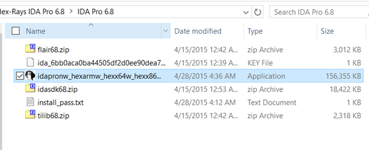

##Getting IDA
According to Ricardo Narvaja´s "Introducción al reversing con IDA Pro desde 0 - Parte 1" tutorial:

> No podemos distribuirlo pero buscando en google IDA PRO 6.8 + HEXRAYS que es la versión que trabajaremos y es la última que esta disponible, podrán bajarlo sin problemas. 
> 
> Allí vemos los archivos que contiene el zip que bajamos, está el instalador que se llama *idapronw_hexarmw_hexx64w_hexx86w_150413_cb5d8b3937caf856aaae750455d2b4ae.exe* y  pide al instalar un password que esta en el archivo install_pass.txt. 
> 
> 
> También al instalar IDA nos instalará Python 2.7.6. Conviene para no tener problemas usar la versión de Python incluida en IDA y previo a la instalación de IDA desinstalar otros Python que haya en la máquina instalados previamente para no conflictuar.

**If there is a license worth its price, it´s IDA´s. Buy it!**

## Installation

* Remove your Python installation to avoid conflicts with IDA
* Install IDA

##### If you want to make your installation compatible with pip and virtualenv
* Remove your Python installation to avoid conflicts with IDA
* Install IDA
* Install Pip
* Install VirtualEnv
* Install VirtualEnvWrapper-Win

*There is a good tutorial for setting up VirtualEnv * [here](http://http://timmyreilly.azurewebsites.net/python-pip-virtualenv-installation-on-windows/)

## Useful plugins
* Keypatch: Make patching easier (https://github.com/keystone-engine/keypatch)
* Ida Sploiter: Tool to find ROP gadgets  (https://thesprawl.org/projects/ida-sploiter/ | https://github.com/iphelix/ida-sploiter)

### Keypatch:
References:
* https://github.com/keystone-engine/keypatch
* http://www.keystone-engine.org/download/

######How to install:
* Install the Microsoft VC++ runtime library (**32 bits**): https://www.microsoft.com/en-gb/download/details.aspx?id=40784
* Install Keystone core & Python binding for Python 2.7 ([keystone-0.9.1-python-win32.msi](https://github.com/keystone-engine/keystone/releases/download/0.9.1/keystone-0.9.1-python-win32.msi)) from http://www.keystone-engine.org/download/ (look for "***Python module for Windows - Binaries***")
* Copy file keypatch.py to IDA Plugin folder, then restart IDA Pro to use Keypatch.

    * On Windows, the folder is at C:\Program Files (x86)\IDA 6.8\plugins
* Restart IDA

### Ida Sploiter:
References:
* https://thesprawl.org/projects/ida-sploiter/
* https://github.com/iphelix/ida-sploiter

######How to install:

* Copy file idasploiter.py to IDA Plugin folder, then restart IDA Pro to use Keypatch.

    * On Windows, the folder is at C:\Program Files (x86)\IDA 6.8\plugins
* Restart IDA